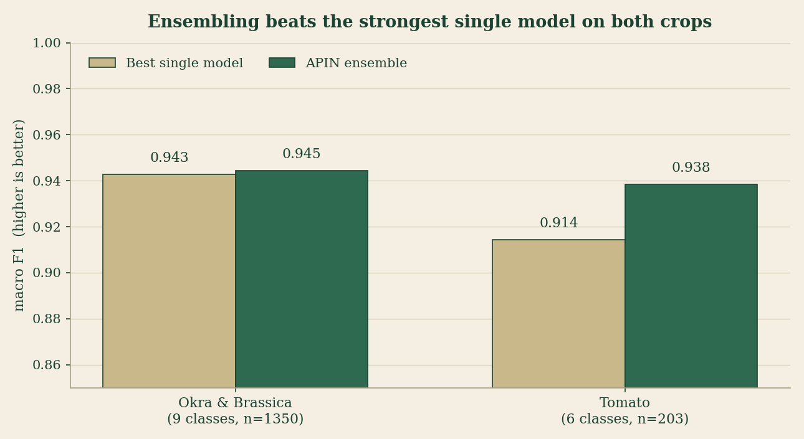
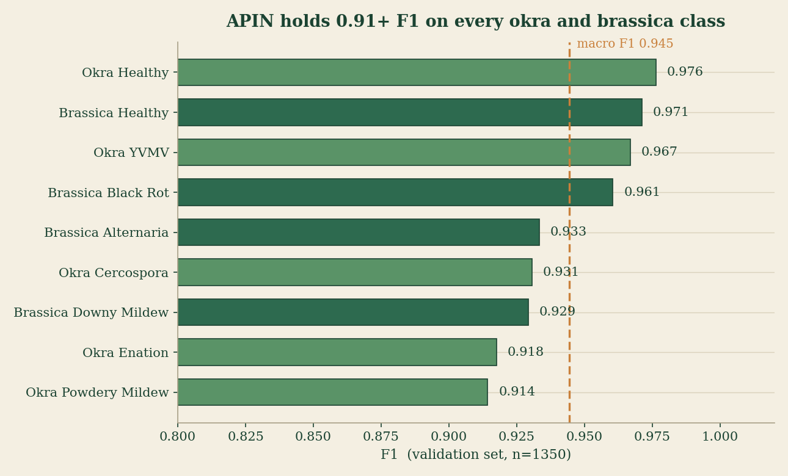
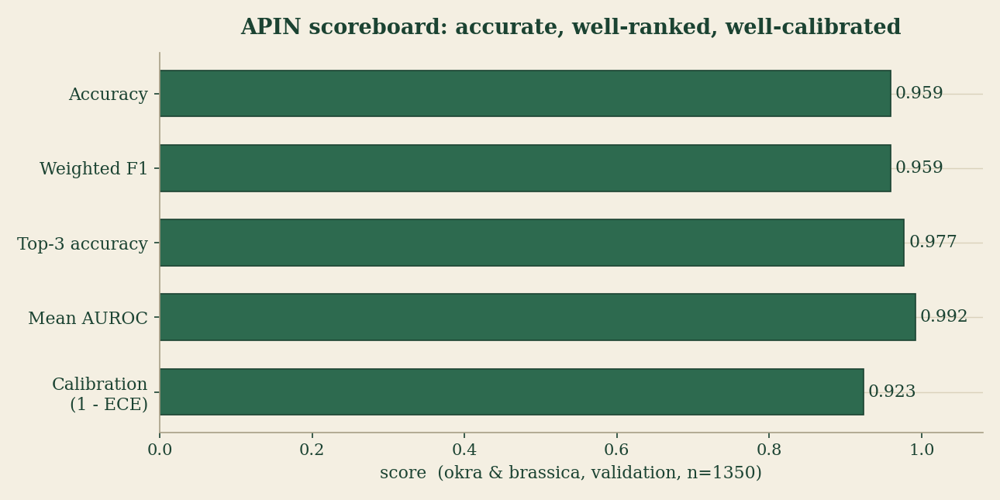

<!-- ====================================================================== -->

# APIN: Adaptive Pathological Intelligence Network

> A field grade plant pathology system that diagnoses leaf disease in
> **tomato**, **okra (ladies finger)** and **brassica (broccoli and cabbage)**
> from a single smartphone photo, and keeps every diagnosis in a personal
> field notebook.

**Live demo:** https://nano-farm-apin.hf.space

```
              .                       APIN
             /|\        one leaf photo  ->  calibrated diagnosis
            / | \       no app install  ->  Grad-CAM heatmap
           /  |  \      no login wall   ->  treatment + prevention
          '~~~|~~~'     3 crops         ->  severity + urgency
              |         15 diseases     ->  honest confidence
        ~~~~~~~~~~~~~
```

---

## What APIN is

APIN is an ensemble disease classifier wrapped in a web app. A farmer
photographs a diseased leaf, and APIN returns the crop, the disease (one or
more), a severity reading, a calibrated confidence, a Grad-CAM heatmap that
shows where the model looked, and specific treatment and prevention advice.

It is not a single model. Several independent models each read the leaf and
produce a signal; a learned gate fuses those signals; a tiered decision layer
turns the fused scores into an answer with an honest confidence level. When
the model is unsure, it says so instead of guessing.

The whole thing runs on free infrastructure: a Hugging Face Space for the app
and a Turso database for accounts and history.

---

## What you get from one photo

| Output | Detail |
|--------|--------|
| Crop | tomato, okra or brassica, identified by a routing model |
| Disease | one or more diseases, multi label (co infections are detected) |
| Severity | mild, moderate or severe |
| Confidence | a calibrated probability, not a raw softmax number |
| Heatmap | a Grad-CAM overlay returned inline as a base64 PNG |
| Treatment | specific to the exact (crop, disease) pair |
| Prevention | specific to the exact (crop, disease) pair |
| Urgency | low, medium or high, with a plain language reason |
| Out of distribution flag | raised when the photo is not a leaf APIN knows |

Logged in users also get a private dashboard: prediction history, a disease
ledger, a 28 day activity calendar and a treatment log. Each account sees
only its own data. Guests get 3 free diagnoses with no account.

---

## Results

All numbers below are measured, not estimated. Okra and brassica come from
the APIN validation set (n=1350); tomato comes from the held back field
validation set (n=203).

### APIN beats the best single model on both crops



Ensembling is the core idea. On tomato the lift is large (best single model
0.914, ensemble 0.938). On okra and brassica the single model was already
strong, and the ensemble still edges ahead while adding calibration and
out of distribution detection that no single model provides.

### Strong on every class, not just the easy ones



A macro average can hide a weak class. APIN holds an F1 of 0.91 or better on
all nine okra and brassica classes, healthy and diseased alike.

### Accurate, well ranked, and well calibrated



A diagnosis is only useful if the confidence can be trusted. APIN applies
per class temperature scaling, so the reported confidence tracks the real
hit rate (expected calibration error 0.077). Mean AUROC of 0.992 means the
ranking of classes is almost always correct even when the top 1 is not.

### Headline numbers

| Crop set | Classes | Macro F1 | Accuracy | Top 3 accuracy | vs best single model |
|----------|--------:|---------:|---------:|---------------:|---------------------:|
| Okra and Brassica | 9 | 0.944 | 0.959 | 0.977 | +0.002 |
| Tomato | 6 | 0.938 | 0.956 | n/a | +0.024 |

Honest note: the tomato classes for yellow leaf curl virus and mosaic virus
have very few held back samples (n=2 and n=4), so their per class scores are
not statistically reliable on their own. The headline tomato number is the
sqrt(N) weighted macro F1, which down weights those thin classes.

---

## The interface

The app is styled as a field diagnostic monograph: cream paper, a serif
display face, washi tape corners, hand drawn accents. One HTML, one CSS, one
JS file. No build step, no framework.

```
 ____________________________________________________________
|  Plant Disease Detection                Sign in / Create -> |
|  --- nanofarm                                               |
|  Pathology Journal . Field diagnostic monograph             |
|  ENTRY NO. ...   SESSION EXJ7YL      [ Full pipeline | ... ]|
|.____________________________________________________________|
|                                                            |
|    \                                                  /    |
|     \                  (  leaf  )                    /     |
|                                                            |
|                  Paste specimen here                       |
|         Drag and drop or click . JPEG / PNG / WebP         |
|     /                                                  \    |
|    /                                                    \   |
|.___________________________________________________________|
```

Uploading a leaf raises a login panel ("Open your field notebook") with three
choices: sign in, create an account, or continue as a guest for 3 free
checks. A diagnosis renders as a result card: the heatmap, crop and severity
badges, the disease heading, a confidence bar, and collapsible treatment and
prevention sections.

---

## How it works

A photo takes one of two paths, chosen by a crop router.

```
                         leaf photo
                             |
                     +-------v-------+
                     |  crop router  |   okra / brassica / chilli / tomato
                     +---+-------+---+
                         |       |
            tomato  <----+       +----> okra, brassica, chilli
                |                            |
        +-------v--------+          +--------v---------+
        | LADI-Net       |          |  APIN ensemble   |
        | v3 + LoRA      |          |  (4 signals)     |
        | specialist     |          |                  |
        +-------+--------+          +--------+---------+
                |                            |
                +-------------+--------------+
                              |
                   diagnosis + heatmap + advice
```

### The APIN ensemble (okra, brassica, chilli)

```
   leaf photo
       |
 [ Gate Zero ]   image quality + leaf coverage check, under 10 ms
       |
   +---+----------------------+
   |                          |
 Branch A                  Branch B
 LAB-CLAHE                 RGB-CLAHE
   |                          |
 +-+------+--------+      EfficientNetV2-S
 |        |        |          |
Model 2  PSV    DINOv2 head   |
(signal1)(signal3)(signal4)  (signal2)
 |        |        |          |
 +--------+---+----+----------+
              |
   4 signals, each 9 class scores  ->  36 numbers
              |
 [ reliability matrix ]   weight each signal by its measured field accuracy
              |
 [ MoE gate + stacking MLP ]   36 -> 128 -> 64 -> 32 -> 9
              |
 [ temperature scaling . conformal sets . Mahalanobis OOD ]
              |
 [ tiered decision logic ]   honest confidence, cold start safeguards
              |
   diagnosis, confidence, heatmap, treatment, urgency
```

Four independent signals read the same leaf:

| Signal | Model | What it contributes |
|--------|-------|---------------------|
| 1 | Model 2: DINOv3 ConvNeXt-Small | strongest single signal, 0.943 val F1 |
| 2 | EfficientNetV2-S with an FPN and FiLM head | a second, architecturally different view |
| 3 | PSV: 66 hand engineered classical CV features | interpretable, texture and colour evidence |
| 4 | DINOv2 probe (frozen backbone, MLP head) | also powers the out of distribution detector |

A Mixture of Experts gate produces four weights per image, and a stacking MLP
combines the 36 numbers into the final 9 class scores. Training used a
two phase schedule with load balancing and a per class floor penalty so no
class is left behind.

### The tomato specialist

Tomato is routed to LADI-Net, an ensemble of a v3 model and a single pass
LoRA specialist (Model 3). On the field validation set the 50/50 ensemble
scores 0.938, ahead of v3 alone (0.914) and the LoRA alone (0.911).

---

## Repository layout

```
APIN/
|-- README.md
|-- requirements.txt
|-- .env.template
|
|-- scripts/
|   |-- apin/             APIN ensemble: inference, signals, server factory
|   |-- apin_v2/          FastAPI app: auth, dashboard, Field Notes UI
|   |-- ladi_net/         LADI-Net tomato pipeline (v3 + LoRA)
|   |-- model3_training/  Model 3 architecture
|   |-- dinov2_probe/     DINOv2 feature probe and OOD detector
|   |-- psv/              Plant Signal Vector feature stack
|   '-- models.py         shared model definitions
|
|-- app/                  Model 2 / Model 3 / router config modules
|-- diagnosis/            the (crop, disease) treatment knowledge base
|-- deploy/               Hugging Face Space deployment tooling
'-- assets/               README figures
```

Model weights (around 722 MB) are not stored in this repository. They live
in the public Hugging Face model repo
[`dxv-404/apin-models`](https://huggingface.co/dxv-404/apin-models) and are
pulled automatically at build time.

---

## Run it

### Docker (mirrors the live deployment)

```bash
git clone https://github.com/Dxv-404/Plant-disease-detection-for-brocolli-and-ladies-finger.git
cd Plant-disease-detection-for-brocolli-and-ladies-finger

python deploy/stage_space.py          # assemble the deploy bundle
docker build -t apin deploy/apin-space
docker run -p 7860:7860 \
  -e TURSO_DATABASE_URL="libsql://<your-db>.turso.io" \
  -e TURSO_AUTH_TOKEN="<your-token>" \
  apin
```

Open http://localhost:7860.

### Local (development)

```bash
python -m venv venv && source venv/Scripts/activate   # Windows Git Bash
pip install -r requirements.txt

# Fetch the model weights into the working tree:
python -c "from huggingface_hub import snapshot_download; \
  snapshot_download('dxv-404/apin-models', repo_type='model', local_dir='.')"

python scripts/apin_v2/apin_server.py --host 0.0.0.0 --port 8766
```

Open http://localhost:8766.

---

## Data and storage

Accounts, predictions and uploaded image BLOBs persist in an external
**Turso** (libSQL) database, selected by the `TURSO_DATABASE_URL` and
`TURSO_AUTH_TOKEN` environment variables. With those unset, the app falls
back to a local SQLite file, which is convenient for development. The full
Hugging Face Space and Turso setup is documented in
[`scripts/apin_v2/DEPLOYMENT.md`](scripts/apin_v2/DEPLOYMENT.md).

Privacy by design: a guest's uploaded photos are never stored. A logged in
user's images are kept only in that user's own account, never shared.

---

## Tech stack

```
Frontend    plain HTML + CSS + JS, no framework, no build step
Backend     FastAPI + Uvicorn
Models      PyTorch, timm, DINOv2 / DINOv3, EfficientNetV2, LoRA (peft)
Explain     Grad-CAM heatmaps
Calibration temperature scaling, conformal prediction, Mahalanobis OOD
Storage     Turso (libSQL) in production, SQLite for local dev
Auth        argon2id password hashing, HttpOnly session cookies
Deploy      Docker on a free Hugging Face Space
```

---

## Status

APIN is deployed and live at https://nano-farm-apin.hf.space. The okra and
brassica ensemble and the tomato specialist are both validated. The locked
test sets stay locked: no model changes are made after final evaluation.
